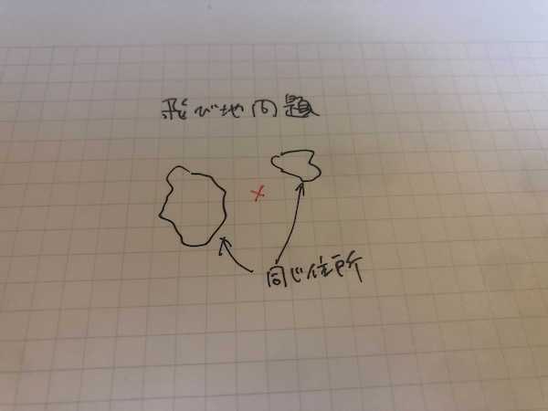

# Geolonia 住所データ

全国の町丁目、大字、小字レベルの住所データ（277,531件）をオープンデータとして公開いたします。

本データは、国土交通省位置参照情報ダウンロードサービスで配布されている「大字・町丁目レベル位置参照情報」をベースとしていますが、「大字・町丁目レベル位置参照情報」データは年に一回更新であるのに対して、本リポジトリで配布するデータは毎月更新しています。

[latest.csvをダウンロード](https://geolonia.github.io/japanese-addresses/latest.csv)

[latest.dbをダウンロード](https://geolonia.github.io/japanese-addresses/latest.db)

[リリースノート](https://github.com/geolonia/japanese-addresses/releases)

## 住所データ仕様

### ファイルフォーマット

- latest.csv: CSV
- latest.db: SQLite3で読み込めるバイナリ形式

### 列

* 都道府県コード
* 都道府県名
* 都道府県名カナ
* 都道府県名ローマ字
* 市区町村コード
* 市区町村名
* 市区町村名カナ
* 市区町村名ローマ字
* 大字町丁目名
* 大字町丁目名カナ
* 大字町丁目名ローマ字
* 小字・通称名
* 緯度（代表点）
* 経度（代表点）

### ソート順

latest.csv の住所の並び番は以下の通りです。

1. 都道府県コード 昇順
2. 市区町村コード 昇順
3. 大字町丁目名カナ 昇順
4. 大字町丁目名 昇順(文字コード順)
5. 小字・通称名 昇順(文字コード順)

例えば都道府県コードが同じ住所同士であれば、市区町村コード 昇順に、市区町村コードも同じであれば、大字町丁目名カナ 昇順に、大字町丁目名カナも同じであれば、大字町丁目名 昇順に、大字町丁目名までも同じであれば、小字・通称名 昇順に並びます。

## API

このデータを使用した API をご提供しています。

#### 都道府県 - 市町村エンドポイント

```
https://geolonia.github.io/japanese-addresses/api/ja.json
```

例: [https://geolonia.github.io/japanese-addresses/api/ja.json](https://geolonia.github.io/japanese-addresses/api/ja.json)

```
{
  "北海道": [
    "札幌市中央区",
    "札幌市北区",
    "札幌市東区",
    ...
  ],
  "青森県": [
    "青森市",
    "弘前市",
    "八戸市",
    ...
  ],
  "岩手県": [
    "盛岡市",
    "宮古市",
    "大船渡市",
    ...
  ],
```

#### 町丁目エンドポイント

```
https://geolonia.github.io/japanese-addresses/api/ja/<都道府県名>/<市区町村名>.json
```

※ 都道府県名及び市区町村名は URL エンコードを行ってください。

例: [https://geolonia.github.io/japanese-addresses/api/ja/%E9%95%B7%E9%87%8E%E7%9C%8C/%E9%95%B7%E9%87%8E%E5%B8%82.json](https://geolonia.github.io/japanese-addresses/api/ja/%E9%95%B7%E9%87%8E%E7%9C%8C/%E9%95%B7%E9%87%8E%E5%B8%82.json)

```
[
  ...
  {
    "town": "篠ノ井塩崎",
    "koaza": "四之宮",
    "lat": 36.555444,
    "lng": 138.10524
  },
  {
    "town": "篠ノ井塩崎",
    "koaza": "越",
    "lat": 36.544766,
    "lng": 138.104657
  },
  {
    "town": "篠ノ井塩崎",
    "koaza": "長谷",
    "lat": 36.548163,
    "lng": 138.101997
  },
  {
    "town": "篠ノ井塩崎",
    "koaza": "明戸",
    "lat": 36.549686,
    "lng": 138.106612
  },
  ...
```

### 小字まで含んだ住所の代表点（緯度、経度）の決め方

「長野県長野市篠ノ井塩崎長谷」のように小字まで含んだ住所については、街区レベル位置参照情報より、その住所に属する街区の緯度、経度を複数取得できるので、以下の方法で代表点を決め、その緯度と経度をAPIで返すようにしています。

例えばA、B、Cの3点が「長野県長野市篠ノ井塩崎長谷」に属する街区だとして、A、B、Cを囲む一番小さな長方形（バウンディングボックス）を作り、その中心を求めます。次にA、B、Cの中からその長方形の中心に最も近い点を選びます。たとえばそれがCだとすると、「長野県長野市篠ノ井塩崎長谷」の代表点はCと決め、その緯度、経度を返すようにしています。

上記方法をとることで、下図のような三日月や飛び地の地形でうまく代表点を決められない問題に対応している。




### 注意

* 町丁目エンドポイントは、すべての地名を網羅しているわけではありません。

## 住所データ・ API のビルド

```shell
$ git clone git@github.com:geolonia/japanese-addresses.git
$ cd japanese-addresses
$ npm install
$ npm run build # 元データのダウンロードと latest.csv 及び latest_gaiku.csv の作成を行います
$ npm run build:api # latest.csv から API を作成します

# オプション
$ node bin/build-gaiku-api.mjs # 街区レベルの API を追加で作成します
$ node bin/download-residential.sh # ベースレジストリのデータのダウンロードを行います
$ node bin/build-jyukyo-api.mjs # 住居符号レベルの API を追加で作成します
```

### API の構成

```shell
└── api
    ├── ja
    │   └── {都道府県名}
    │       ├── {市区町村名}
    │       │   ├── {町丁目名}
    │       │   │   └── 住居表示.json # 住居表示住所リスト
    │       │   └── {町丁目名}.json   # 街区リスト
    │       └── {市区町村名}.json     # 町丁目リスト
    └── ja.json                     # 市区町村リスト
```

```typescript
/*
 * @file api/ja.json
 * 市区町村名リスト
 */
{
  [都道府県名 as string]: string[];
}

/*
 * @file api/ja/{都道府県名}/{市区町村名}.json
 * 町丁目リスト
 */
{
  town: string;
  koaza: string;
  /* 町丁目の代表点の緯度の値 */
  lat: number;
  /* 町丁目の代表点の経度の値 */
  lng: number;
  /* true の場合、住居表示住所が存在することを示します */
  residential?: true;
}[]

/*
 * @file api/ja/{都道府県名}/{市区町村名}/{町丁目名}.json
 * 街区リスト
 */
{
  /* 街区符号の値。数字文字列 */
  gaiku: string;
  /* 街区の代表点の緯度の値 */
  lat: number;
  /* 街区の代表点の経度の値 */
  lng: number;
}[]

/*
 * @file api/ja/{都道府県名}/{市区町村名}/{町丁目名}/住居表示.json
 * 住居表示住所（フロンテージ）リスト
 */
{
  /* 街区符号の値。数字文字列 */
  gaiku: string;
  /* 住居番号の値。数字文字列 */
  jyukyo: string;
  /* フロンテージの緯度の値 */
  lat: number;
  /* フロンテージの経度の値 */
  lng: number;
}[]
```


## 出典

本データは、以下のデータを元に、毎月 Geolonia にて更新作業を行っています。

* [国土交通省位置参照情報ダウンロードサイト](https://nlftp.mlit.go.jp/cgi-bin/isj/dls/_choose_method.cgi)
* [郵便番号データダウンロード - 日本郵便](https://www.post.japanpost.jp/zipcode/download.html)

また、住居表示住所 API は「アドレス・ベース・レジストリ」（デジタル庁）[住居表示住所・住居マスターデータセット](https://registry-catalog.registries.digital.go.jp/dataset?q=%E4%BD%8F%E5%B1%85%E8%A1%A8%E7%A4%BA&sort=metadata_modified+desc) をもとに株式会社 Geolonia が作成したものです。

## 貢献方法

* 本データに不具合がある場合には、[Issue](https://github.com/geolonia/japanese-addresses/issues) または[プルリクエスト](https://github.com/geolonia/japanese-addresses/pulls)にてご報告ください。

## japanese-addressesを使っているプロジェクト

* [JapaneseAddressParser](https://github.com/yamat47/japanese_address_parser) 日本の住所をパースすることができる Ruby gem

## スポンサー

* [一般社団法人 不動産テック協会](https://retechjapan.org/)

## 関連情報

* [【プレスリリース】不動産テック協会、Geolonia と共同で不動産情報の共通 ID 付与の取り組みを開始](https://retechjapan.org/news/archives/pressrelease-20200731/)
* [【プレスリリース】日本全国の住所マスターデータをオープンデータとして無料公開](https://geolonia.com/pressrelease/2020/08/05/japanese-addresses.html)

## ライセンス

Geolonia 住所データのライセンスは以下のとおりです。

[CC BY 4.0](https://creativecommons.org/licenses/by/4.0/deed.ja)

注: リポジトリに同梱されているデータ生成用のスクリプトのライセンスは MIT ライセンスとします。
